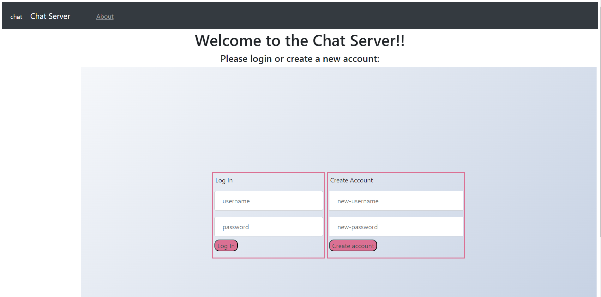
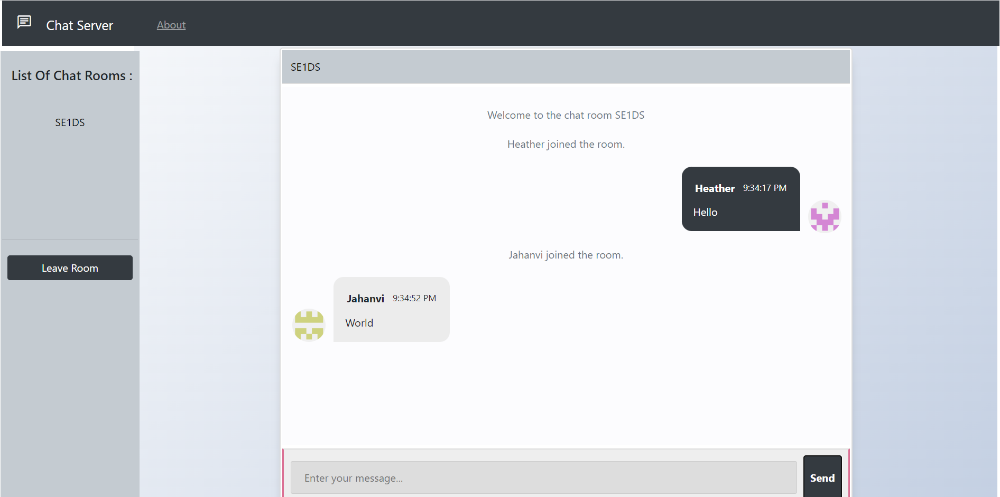

# Group Project - Chat Server
> Course: CSCI 2020U: Software Systems Development and Integration

> Group Members: Jahanvi Mathukia, Gabe Manaog, and Heather Meatherall

### Project Information
The following project is web chat server that has the ability to make multiple rooms.
Once the user enters their log in information, you can join an existing room or create a new one.
Once inside a chatroom, only the other members of the room can view your messages.

### How-To-Run
To run this program, first download the files off of GitHub using git clone.
Open the project folder in the IDE of your choice (VSCode, Intellij ect). Create Glassfish Local configuration.
Run the configuration. This will open a webpage with two forms, Create Account and Login. Type a username and password into the Log In box. This will allow you to enter the chatroom.
Once you're inside the chatroom,  the create and join room button will be visible. Click on it to join an existing chat room or create a new one.
You can then type your message in the message box or leave the room.

### Improvements
The chat server should only allow people with an existing account to enter the server. Create Account Form should take the user input and
add it to a file, which the server uses to verify the input given in the Log In Form.

### Other Resources
[1] Bootstrap: https://cdn.jsdelivr.net/npm/bootstrap@4.0.0/dist/css/bootstrap.min.cs